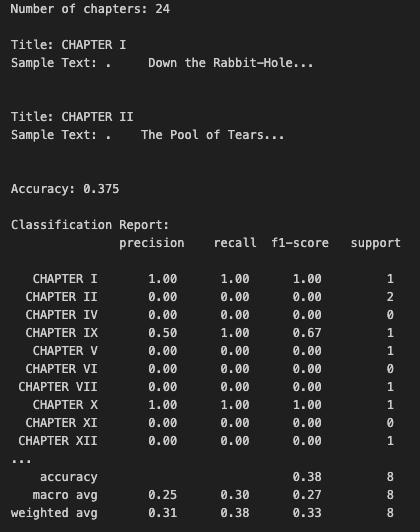

# A-Project 2: NLTK Text Analysis & Classification — *Alice in Wonderland*

This project applied **Natural Language Processing (NLP)** techniques using **NLTK** and **scikit-learn** to analyze and classify text from *Alice’s Adventures in Wonderland* by Lewis Carroll.  
The goal was to explore linguistic patterns and train a model to classify chapters based on word usage and stylistic features.

* **Dataset:** *Alice’s Adventures in Wonderland* (Project Gutenberg)  
* **Tools:** Python, NLTK, scikit-learn, CountVectorizer, matplotlib  
* **Techniques:** Tokenization, stopword removal, lemmatization, vectorization, Naive Bayes classification  
* **Goal:** Identify vocabulary trends across chapters and evaluate classification accuracy.

---

### ⚙️ Text Preprocessing
1. **Download text:** Retrieved from Project Gutenberg using `requests`.  
2. **Clean content:** Removed special characters and headers.  
3. **Split into chapters:** Used regex to identify Roman numeral chapter headings.  
4. **Tokenize & remove stopwords:** NLTK’s `word_tokenize()` and `stopwords`.  
5. **Vectorize:** Converted text into numerical features using `CountVectorizer`.

---

### 🧩 Vocabulary Construction
Custom stopword lists were merged and applied to extract the most representative words.  
Each token received a unique index in the vocabulary using **CountVectorizer**.

  
  
<em>Vocabulary generation with token–ID mapping for words in the corpus.</em>

---

### 🧪 Classification Experiment
Each chapter was treated as a labeled text sample.  
A **Multinomial Naive Bayes** classifier was trained to predict which chapter a given excerpt belonged to.

**Process:**
- Converted chapters to numerical vectors.  
- Split dataset into **train (70%)** and **test (30%)** sets.  
- Trained the model and evaluated prediction accuracy.

  
  
<em>Model training and classification report with 0.375 accuracy.</em>

| Metric | Value |
|---------|-------|
| Accuracy | 0.38 |
| Macro Avg Precision | 0.25 |
| Macro Avg Recall | 0.30 |
| Weighted Avg F1 | 0.33 |

Despite modest performance, the model captured stylistic variation between chapters—such as vocabulary density and dialogue frequency.

---

### 📊 Linguistic Insights
- Frequent nouns: **Alice, Queen, King, Rabbit, Time**  
- Frequent verbs: **said, thought, went, replied**  
- Dialogue-heavy chapters contain more pronouns and verbs.  
- Later chapters emphasize descriptive adjectives and nouns.

---

### 🧠 Skills Demonstrated
- Text preprocessing and tokenization using **NLTK**  
- Feature extraction with **CountVectorizer**  
- Supervised text classification using **Naive Bayes**  
- Evaluation and linguistic interpretation of text patterns  

📓 [View Jupyter Notebook](NLTK_Alice.ipynb)

